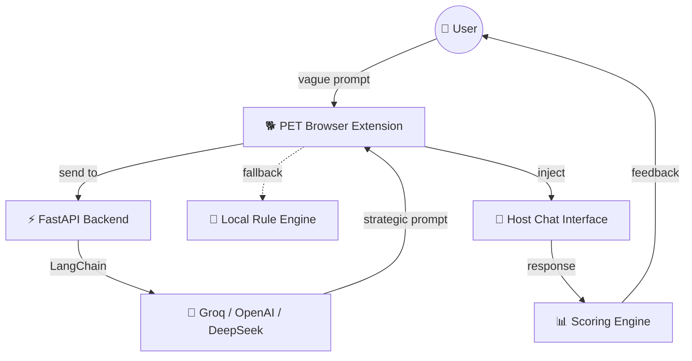

---

## 📖 Table of Contents
- [🐕 What is PET?](#-what-is-pet)
- [🏗️ Visual Architecture](#️-visual-architecture)
- [✨ Key Features](#-key-features)
- [📁 Project Structure](#-project-structure)
- [🛠️ Installation Guide](#️-installation-guide)
- [🚀 How to Use](#-how-to-use)
- [👋 About the Builder](#-about-the-builder)
- [📜 License](#-license)
- [🤝 Contributing & Support](#-contributing--support)

---

## 🐕 What is PET?

**PET (Prompt Enhancement Tool)** is a high‑performance browser extension that lives **inside** your favorite AI platforms. It transforms vague, one‑line queries into **40+ line strategic prompt architectures** using professional engineering techniques like **Chain‑of‑Thought**, **Socratic Method**, and **Few‑Shot prompting**.

> 🎯 **Stop chatting with AI. Start architecting with your personal companion.**

### 📈 Why PET?
- 🚀 **10x better responses** — structured prompts unlock reasoning depth
- 🧠 **Learn prompt engineering** by example — see how pros build prompts
- ⚡ **Zero context switching** — works inside your existing chat interface

---

## 🏗️ Visual Architecture



---

## ✨ Key Features

| Feature | Description |
|---------|-------------|
| 🐾 **Smart Rewrite** | Turns `"explain physics"` into a structured, role‑based, multi‑step roadmap. |
| 📊 **Response Scoring** | Real‑time 0–100 evaluation of AI responses based on goal coverage + reasoning depth. |
| 🧪 **Multi‑Model Mastery** | Custom‑tuned logic for ChatGPT, Claude, Gemini, and DeepSeek. |
| 🛡️ **Fail‑Safe Design** | 8‑second timeouts + local rule‑based fallback — works even if backend is offline. |
| 🎨 **Premium UI** | Glassmorphic sidebar, fluid Lottie animations, zero‑footprint draggable widget. |
| 📈 **Growth Dashboard** | Track prompt quality trends and model performance over time. |

---

## 📁 Project Structure

```text
.
├── 📂 backend/           # FastAPI + LangChain Intelligence
│   ├── main.py           # API routes & webhook handling
│   ├── agents.py         # Prompt architect logic & decision trees
│   └── memory_store.py   # Tab‑isolated session management
│
├── 📂 src/               # Chrome extension source
│   ├── 📂 content/       # UI components (React + Vite)
│   ├── 📂 background/    # Service worker & message bridge
│   └── 📂 engines/       # API logic, scoring, & metrics
│
├── 📂 website/           # Landing page — “The Forest”
│   └── index.html        # High‑fidelity marketing site
│
└── 📂 dist/              # Production‑ready extension build
```

---

## 🛠️ Installation Guide

### 1. The Intelligence (Backend)

```bash
cd backend
pip install -r requirements.txt
# Add your GROQ_API_KEY to .env
uvicorn main:app --reload
```

> 💡 **Optional**: Also supports OpenAI / DeepSeek keys — see `agents.py` for configuration.

### 2. The Companion (Extension)

1. **Download** the `dist/` folder from this repo.
2. Open **Chrome** → `chrome://extensions`.
3. Enable **Developer Mode** (top‑right).
4. Click **Load unpacked** → select the `dist/` folder.
5. 🎉 Your Pet appears in the corner on ChatGPT, Claude, Gemini, or DeepSeek!

---

## 🚀 How to Use

1. **Type** a rough idea in the chat box  
   *(e.g., `"how to build a SaaS"`)*
2. **Click the Pet** to open the architect panel.
3. Hit **▶ Rewrite** — PET generates **3 strategic versions** of your prompt.
4. **Use Prompt** to inject the version you like into the chat box.
5. **Score** the AI’s reply to see how well it followed the strategy.

> 🏆 **Pro tip**: Higher scores (80+) mean the AI deeply followed your prompt architecture. Low scores? Try another rewrite version!

---

## 👋 About the Builder

**Krishianjan Lanka**  
*Data Grad · AI Engineer · Builder focused on Design & Execution*

> *“I built PET because I got tired of seeing people get mediocre AI responses from vague prompts. PET makes prompt engineering accessible to everyone — from Doctors to Plumbers — allowing anyone to prompt like a professional engineer.”*

[](https://github.com/krishianjan)
[](https://linkedin.com/in/krishianjan)
[](https://calendar.app.google/WXuW4o4aY1baTqeY6)

---

## 📜 License

This project is licensed under the **MIT License** — see the [LICENSE](LICENSE) file for details.

---

## 🤝 Contributing & Support

- 🐛 **Found a bug?** [Open an issue](https://github.com/krishianjan/pet-extension/issues)
- 💡 **Have an idea?** Pull requests are welcome — we’re `first‑timers‑friendly`
- 💬 **Join the community** on [Discord](https://discord.gg/invite-link) (placeholder, replace with your invite)
- ⭐ **Star this repo** — it helps more people find PET and levels up prompt engineering for everyone

<p align="center">
  
  <br>
  <i>🌿 Built with ❤️ for better conversations with AI.</i>
</p>
```
